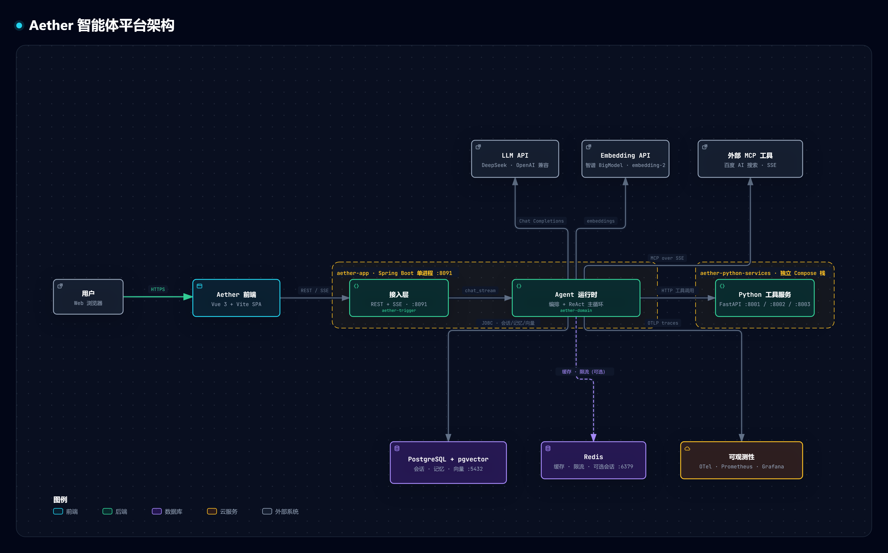

# Aether

> 基于 Java 17 + Spring Boot 3 + Spring AI 的 DDD 六模块多 Agent 脚手架：内置 Agent 编排、RAG 检索、MCP 工具接入、长期记忆、模型故障转移与效果评测能力，可通过 Docker Compose 一键起全栈。

## 系统架构



## 主要功能特性

- **多 Agent 编排**：通过 `agent/agents.yml` 声明式定义 Agent（内置旅游规划、对话陪伴两个示例 Agent），支持子 Agent 委派（spawn / pause / interrupt）与运行状态查询。
- **对话与会话管理**：支持普通对话与 SSE 流式对话（`chat_stream`），会话与消息持久化到 PostgreSQL，并提供会话列表 / 消息回放接口。
- **MCP 工具接入**：支持 SSE 与 Stdio 两种 MCP Server 接入方式（`SSEToolMcpCreateService` / `StdioToolMcpCreateService`），示例 Agent 已接入 `baidu-search`；提供 MCP 热刷新接口。
- **RAG 检索增强**：基于 PostgreSQL + pgvector 的向量存储（`PgvectorVectorStore`）与混合检索（`PgHybridSearchRepository`）。
- **长期记忆**：记忆门面 `MemoryFacade` / `MemorySlice`，支持记忆衰减存储（`PgMemoryDecayStore`）。
- **模型路由与故障转移**：`ModelRoute` + `ModelErrorClassifier` 实现模型错误分类与降级切换；Redis 模型缓存（`RedisModelCacheStore`）。
- **安全体系**：用户注册 / 登录 / Token 刷新（JWT），登录接口限流（5 次/分/IP），Jasypt 配置加密，SSRF 防护拦截器，审计日志。
- **可观测性**：集成 OpenTelemetry；fullstack 编排内置 Prometheus + Grafana + Alertmanager。
- **效果评测**：`EvalRunnerTest` 内置 50 条确定性评测用例（工具选择 20 / 多步推理 15 / 上下文保持 10 / 权限 5），支持 mock 模式离线运行。
- **性能压测**：`benchmark/` 提供 k6 四组场景（smoke / capacity / chaos / cache）+ FastAPI mock-llm（可控 TTFT 与故障注入），`run.sh` 一键产出压测报告。

## 技术栈与运行环境

| 类别 | 技术选型 |
|------|----------|
| 语言 / 运行时 | Java 17 |
| 框架 | Spring Boot 3.4.3、Spring AI 1.1.0-M3、Google ADK 0.5.0、LangChain4j 1.4.0 |
| 数据库 | PostgreSQL 16 + pgvector（向量检索） |
| 缓存 / 会话 | Redis |
| 消息队列 | Kafka（`aether-types` 定义消息契约与 Topic） |
| 认证 / 加密 | JWT（jjwt 0.12.5）、Jasypt |
| 可观测 | OpenTelemetry 1.41.0、Prometheus、Grafana |
| 构建 / 测试 | Maven（JaCoCo 覆盖率）、JUnit、Testcontainers 2.0.2、k6 |

**环境要求**：

- Docker（含 compose v2）——推荐方式；
- 或本地：JDK 17+、Maven 3.6+、PostgreSQL 16（含 pgvector 扩展）、Redis；
- 运行集成测试（`mvn verify -Pintegration`）需要本机 Docker（Testcontainers）。

## 安装与使用

### 方式一：Docker Compose（推荐）

```bash
# 1. 克隆仓库
git clone https://gitee.com/zuo-changjian/ai-agent-scaffold-lite.git && cd ai-agent-scaffold-lite/aether

# 2. 准备环境变量（按需修改）
export DB_PASSWORD=123456 JWT_SECRET=aether-dev-jwt-secret-key-min-32-chats!!

# 3. 构建并启动（多阶段构建：Maven 打包 → JRE 非 root 运行时）
docker compose -f docker/docker-compose-secure.yml up -d --build

# 4. 健康检查（首次构建约 5-10 分钟，冷启动约 90s）
curl -fsS http://localhost:8091/actuator/health
```

### 方式二：本地构建运行

```bash
mvn -B verify                                   # 构建 + 全部单元测试 + JaCoCo 报告
java -jar aether-app/target/aether-app.jar --spring.profiles.active=dev
```

其他常用命令：

```bash
mvn -B -pl aether-app test -Dtest=EvalRunnerTest   # 运行 50 条 Agent 效果评测（mock 模式）
mvn verify -Pintegration                           # 集成测试（Testcontainers，需 Docker）
```

### 压测（无需外网，内置 mock-llm）

```bash
docker compose -f docker/docker-compose-bench.yml up -d --build
cd benchmark && ./run.sh    # 产物见 benchmark/results/ 与 docs/benchmark-report.md
```

## 目录结构

```
aether/
├── aether-api/            # 对外契约：DTO、统一 Response、IAgentService 接口
├── aether-app/            # 启动模块：Application 启动类、配置、安全装配、Kafka 消息
│   └── src/main/resources/
│       ├── application*.yml   # dev / test / prod / bench 四套 profile
│       ├── agent/agents.yml   # Agent 声明式定义
│       └── schema.sql         # 数据库初始化脚本
├── aether-domain/         # 领域核心：Agent 编排、RAG、MCP、记忆、技能、模型路由、评测
├── aether-trigger/        # 入口层：HTTP Controller、定时任务、事件监听
├── aether-infrastructure/ # 基础设施：PG/pgvector/Redis 持久化、JWT/Jasypt、OTel
├── aether-types/          # 公共类型：常量、枚举、异常、Kafka 消息契约
├── data/sql/              # V1~V5 数据库迁移脚本（幂等）
├── docker/                # 多套 docker-compose 编排（见"配置说明"）
├── benchmark/             # k6 压测脚本 + mock-llm + 一键压测入口
├── docs/                  # 架构文档、压测报告、前端工程
└── scripts/               # 辅助脚本
```

## 关键模块与接口

### HTTP 接口（默认端口 8091）

| 接口 | 路径 | 说明 |
|------|------|------|
| 认证 | `POST /api/v1/auth/register` `/login` `/refresh` | 注册 / 登录（JWT）/ 刷新 Token |
| 对话 | `POST /api/v1/chat`、`POST /api/v1/chat_stream` | 普通对话 / SSE 流式对话 |
| 会话 | `POST /api/v1/create_session`、`GET /api/v1/list_sessions`、`GET /api/v1/session_messages` | 会话管理 |
| 编排 | `/api/orchestration/active-subagents`、`/spawn`、`/pause`、`/interrupt`、`/delegations` | 子 Agent 编排控制 |
| MCP | `POST /api/mcp/refresh` | MCP 工具热刷新 |

### 冒烟示例

```bash
# 注册 → 登录拿 token → 发起一次对话
curl -s -X POST http://localhost:8091/api/v1/auth/register -H 'Content-Type: application/json' \
     -d '{"username":"demo","password":"demo-pass-123"}'
TOKEN=$(curl -s -X POST http://localhost:8091/api/v1/auth/login -H 'Content-Type: application/json' \
     -d '{"username":"demo","password":"demo-pass-123"}' | python -c "import sys,json;print(json.load(sys.stdin)['data']['accessToken'])")
curl -s -X POST http://localhost:8091/api/v1/chat -H "Authorization: Bearer $TOKEN" \
     -H 'Content-Type: application/json' -d '{"agentId":"1","userId":"demo","message":"你好"}'
```

### 领域核心（aether-domain）

- `agent/service/agent/core`：Agent 执行内核（`Agent`、`AgentResult`、`Plan`）；
- `agent/service/armory`：装配层——Agent 注册表、MCP（SSE/Stdio）与技能（Skills）创建服务；
- `agent/service/memory`：长期记忆（`MemoryFacade`、`MemorySlice`）；
- `agent/service/retrieval/rag`：RAG 检索；
- `agent/service/model/failover`：模型路由与故障分类转移；
- `agent/service/tool`、`session`、`executor`、`compiler`：工具注册、会话、执行器与编译器。

## 配置说明

### 环境变量

| 变量 | 必填 | 说明 |
|------|------|------|
| `DB_PASSWORD` | 是（Docker 部署） | PostgreSQL 密码 |
| `JWT_SECRET` | 是 | JWT 签名密钥（建议 ≥ 32 字符） |
| `ZHIPU_API_KEY` | prod 必填 | 智谱 Embedding / 记忆向量化（dev/bench 有空默认值） |
| `DEEPSEEK_API_KEY` | 评测真实模式必填 | `EvalRunnerTest` 真实模型评测 |
| `REDIS_HOST` / `REDIS_PORT` | 可选 | Redis 连接（默认本地） |
| `KAFKA_BOOTSTRAP_SERVERS` | 可选 | Kafka 集群地址 |

### Agent 定义

`aether-app/src/main/resources/agent/agents.yml` 声明式定义 Agent。内置示例：`Agent01`（id=1，旅游规划）与 `Agent02`（id=2，对话陪伴），模型为 `deepseek-v4-flash`，MCP 接入 `baidu-search`（SSE）。**使用前需配置真实可用的 `api-key`**；离线演示可使用 benchmark 压测栈的内置 mock-llm。

### Profile 与编排文件

- Spring profile：`dev`（默认）/ `test` / `prod` / `bench`，端口均为 8091；
- `docker-compose-secure.yml`：主服务 + PostgreSQL（最小核心闭环）；
- `docker-compose-fullstack.yml`：主服务 + PG + Redis + Kafka + Prometheus + Grafana + Alertmanager；
- `docker-compose-bench.yml`：PG + mock-llm + bench profile 主服务（压测）；
- `docker-compose-scale.yml` / `scale-single.yml`：Nginx 多实例水平扩容。

## 运行效果

- 健康检查：`GET /actuator/health` 返回 `{"status":"UP"}`；
- 对话接口返回统一响应 `{"code":"0000",...,"data":{"content":"..."}}`；
- 压测产物：`benchmark/results/<时间戳>/` 下 k6 结果 JSON 与 `docs/benchmark-report.md` 报告；
- 测试规模：全仓 127 个测试类（domain 92 / app 15 / infrastructure 15 / trigger 5），JaCoCo 行级覆盖率报告随 `mvn verify` 产出。

## 许可证

[Apache License 2.0](https://www.apache.org/licenses/LICENSE-2.0)（依据根 `pom.xml` 的 `<licenses>` 声明）。

## 致谢与链接

- 作者：zuochangjian（[Gitee 主页](https://gitee.com/zuo-changjian)）
- 更多细节见 `QUICKSTART.md`（5 条命令跑通全栈）与 `docs/` 下的架构文档。
