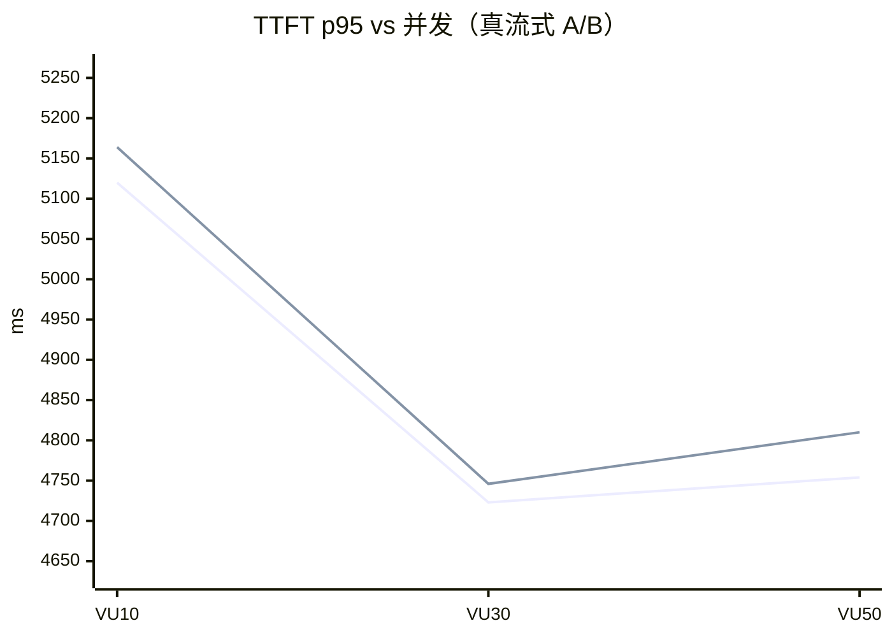
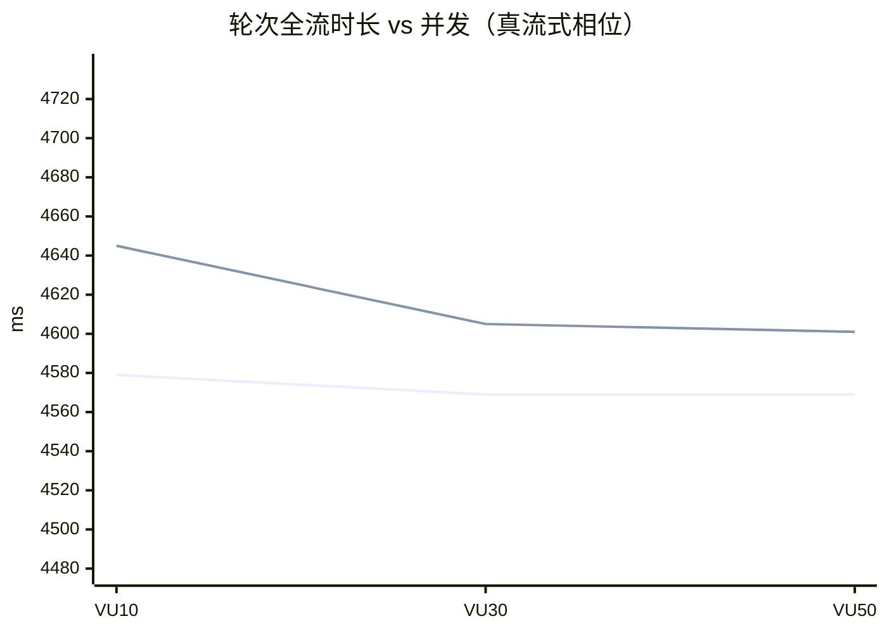

# Aether 性能压测报告（P0 1.5）

> 结果目录：`20260831_194601`（由 `benchmark/run.sh` 产出，本文件由 `generate_report.py` 自动生成）  
> 方法论：mock-llm（TTFT 500ms / 10 chunk × 450ms ≈ 4.5s）；每 VU 一条会话 × 10 轮 `chat_stream`；
> TTFT 由 `probe/ttft_probe.py` 独立并发测量（k6 为整读语义，仅测全流时长）。

## 1. 并发容量（每轮全流时长）

| 并发 VU | 相位 | 轮次 p50 (ms) | 轮次 p95 (ms) | 会话 p50 (ms) | 轮错误率 |
|---:|---|---:|---:|---:|---:|
| 10 | 真流式(true) | 4579 | 4645 | 47874 | 0.00% |
| 30 | 真流式(true) | 4569 | 4605 | 47726 | 0.00% |
| 50 | 真流式(true) | 4569 | 4601 | 47726 | 0.00% |
| 10 | 缓冲(false) | 4580 | 5031 | 48254 | 0.00% |
| 30 | 缓冲(false) | 4570 | 4593 | 47742 | 0.00% |
| 50 | 缓冲(false) | 4569 | 4609 | 47759 | 0.00% |

## 2. TTFT（请求 → 首个 textDelta 帧）

| 并发 VU | 相位 | p50 (ms) | p90 (ms) | p95 (ms) | p99 (ms) | 样本 | 错误 |
|---:|---|---:|---:|---:|---:|---:|---:|
| 10 | 真流式(true) | 5,112 | 5,120 | 5,120 | 5,120 | 20 | 0 |
| 30 | 真流式(true) | 4,628 | 4,711 | 4,723 | 4,740 | 60 | 0 |
| 50 | 真流式(true) | 4,649 | 4,739 | 4,754 | 4,776 | 100 | 0 |
| 10 | 缓冲(false) | 5,152 | 5,162 | 5,164 | 5,164 | 20 | 0 |
| 30 | 缓冲(false) | 4,628 | 4,732 | 4,746 | 4,754 | 60 | 0 |
| 50 | 缓冲(false) | 4,698 | 4,790 | 4,810 | 4,820 | 100 | 0 |

## 3. 真流式 A/B（aether.model.invoker.true-streaming）

| 并发 VU | TTFT 真流式 p95 | TTFT 缓冲 p95 | Δ | 轮 p95 真流式 | 轮 p95 缓冲 |
|---:|---:|---:|---:|---:|---:|
| 10 | 5,120 | 5,164 | -44 | 4645 | 5031 |
| 30 | 4,723 | 4,746 | -23 | 4605 | 4593 |
| 50 | 4,754 | 4,810 | -55 | 4601 | 4609 |

## 4. 容错混沌（429×3 → 500×2 → 成功）

| 恢复耗时 med (ms) | 恢复耗时 max (ms) | 稳态耗时 med (ms) | 断言通过率 |
|---:|---:|---:|---:|
| 196,619 | 196,619 | 4,567 | 100% |

## 5. LLM 响应缓存（仅缓冲路径；指标 `aether.cache.llm.hitrate`）

| 冷调用 med (ms) | 热调用 p95 (ms) | 加速比 |
|---:|---:|---:|
| 4,577 | 14 | 331x |

## 6. 结论与关键发现

- 上述数字全部由 mock-llm 节奏（TTFT 500ms/总 4.5s）驱动，用于**相对比较**（真流式 vs 缓冲、
  并发拐点、缓存收益、混沌恢复），绝对值需换算为真实模型节奏。
- 容量规划：`单实例并发会话上限 ≈ graphPool(max) × 每会话模型耗时/轮均摊`，以轮 p95 未显著
  抬升、错误率 <5% 的最大 VUS 为实测上限。

### 6.1 真流式收益被容错包装层中和（P1 修复项）

- 真流式 p95=4754ms vs 缓冲 p95=4810ms（Δ=-55ms，<2%）——两种模式
  的首个 textDelta 都在**全量响应完成后**一次性到达（实测真流式模式下单帧 439B @ ~5s）。
  根因：`ResilientChatModelExecutor.stream()` 将流式调用委托给 `call()`（Flux.defer 全缓冲），
  chunk 级下发在容错包装层被聚合。**修复方向（P1）**：为流式路径提供透传通道（逐 chunk 转发 +
  错误分类失败时降级重放），恢复 O5 真流式的 TTFT 收益。

### 6.2 缓存收益

- 同 key 重复请求：冷调用 med=4577ms → 热调用 p95=14ms
（**331x 加速**）；命中率经 `aether.cache.llm.hitrate` Gauge 暴露至 Prometheus。

### 6.3 容错链路（混沌验证通过）

- 429×3（自适应退避 30/60/90s）→ 500×2（抖动退避 + fallback 切换）→ 成功：
恢复耗时 197s，最终成功率 100%；恢复路径可经
  `aether.model.recovery.branch{branch=}` 与 `aether.model.fallback.switches` 指标核对。

### 6.4 本次实压发现的生产问题

1. **多表装配 ChatModel Bean 串线**：`ChatModelNode.registerPerAgentChatModel` 在 Agent 无
   per-agent model/toolNames 定制时跳过独立 Bean，多张 Agent 表共享全局 `chatModel` Bean，
   后装配的表覆盖先装配的表（本次压测 agent 201 被串到混沌模型的 api-key）。当前以 per-agent
   `model:` 覆盖规避（bench-agents.yml），**P1 建议修复装配逻辑**（全局 Bean 去重或按表隔离）。
2. **异常转发 /error 被 401 掩盖**：业务异常转发到 `/error` 后被 SecurityConfig 拦截返回
   401（真实错误不可见）。建议 SecurityConfig 对 `/error` 放行（或自定义 ErrorController）。
3. 非root容器日志目录：首次启动因 `/app/logs`、`/app/data/log` 不可写失败，Dockerfile 已预建。
## 7. 可视化（并发曲线）

